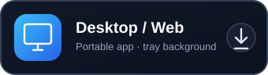
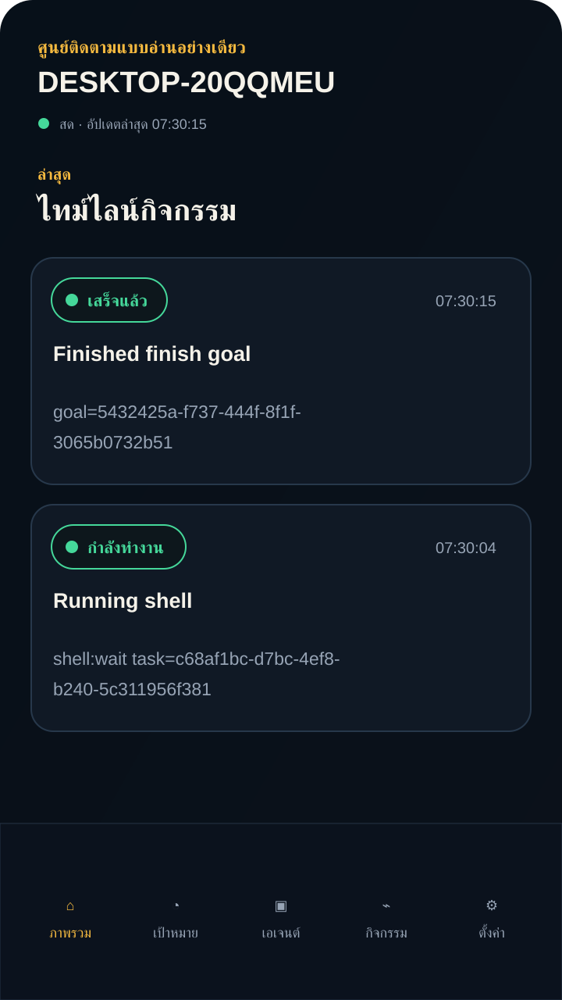
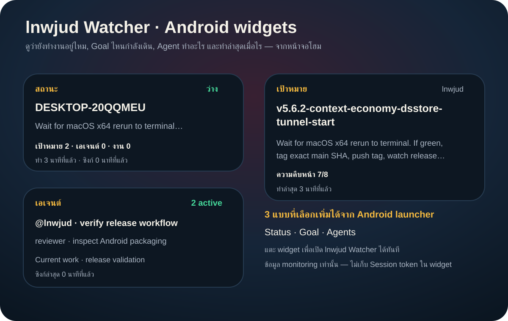

<p align="center">
  
</p>

<h1 align="center">lnwjud Watcher — คู่มือภาษาไทย</h1>

<p align="center">
  <a href="README.md"><strong>English README</strong></a>
  ·
  <a href="https://github.com/engasnm111/lnwjud"><strong>LNWJUD</strong></a>
  ·
  <a href="https://github.com/engasnm111/lnwjud-watcher/releases/latest"><strong>ดาวน์โหลดรุ่นล่าสุด</strong></a>
</p>

<h2 align="center">ดาวน์โหลด lnwjud Watcher</h2>

<table align="center">
  <tr>
    <td align="center" width="33%">
      <a href="https://github.com/engasnm111/lnwjud-watcher/releases/latest/download/lnwjud-watcher-windows-x64.exe"></a><br />
      <sub>Windows Portable EXE · <a href="https://github.com/engasnm111/lnwjud-watcher/releases/latest/download/lnwjud-watcher-macos-arm64.dmg">macOS Apple silicon</a> · <a href="https://github.com/engasnm111/lnwjud-watcher/releases/latest/download/lnwjud-watcher-macos-x64.dmg">macOS Intel</a> · <a href="https://github.com/engasnm111/lnwjud-watcher/releases/latest/download/lnwjud-watcher-linux-x64.AppImage">Linux</a></sub>
    </td>
    <td align="center" width="33%">
      <a href="https://github.com/engasnm111/lnwjud-watcher/releases/latest/download/lnwjud-watcher-android.apk"></a><br />
      <sub>Android APK · แตะติดตั้งได้โดยตรง</sub>
    </td>
    <td align="center" width="33%">
      <a href="https://engasnm111.github.io/lnwjud-watcher/"></a><br />
      <sub>iPhone/iPad: Safari → เพิ่มไปยังหน้าจอโฮม · <a href="https://engasnm111.github.io/lnwjud-watcher/">Web/PWA</a></sub>
    </td>
  </tr>
</table>

<p align="center"><a href="docs/INSTALL.md"><strong>คู่มือติดตั้งแบบคนทั่วไป →</strong></a> · <a href="https://github.com/engasnm111/lnwjud-watcher/releases/latest"><strong>ดูไฟล์ release ทั้งหมด →</strong></a></p>

## ดูหน้าตา lnwjud Watcher ก่อนติดตั้ง

<table>
  <tr>
    <td width="50%" align="center"><strong>Activity บนมือถือ</strong><br /><sub>ดูงานที่ Runtime มองเห็นจริง สถานะ เวลา command และ task ID</sub></td>
    <td width="50%" align="center"><strong>Android Home Screen Widget</strong><br /><sub>สถานะ, Goal และ Agents ดูได้โดยไม่ต้องเปิดแอป</sub></td>
  </tr>
  <tr>
    <td align="center"></td>
    <td align="center"></td>
  </tr>
</table>

Widget เน้นคำถามสำคัญเวลาปล่อยงานยาว ๆ: **ตอนนี้กำลังทำอะไรอยู่ และทำอะไรล่าสุดไปกี่นาทีแล้ว** เพื่อให้เห็นได้ทันทีว่างานยังเดินอยู่หรือหยุดไปตั้งแต่เมื่อไร

---

## lnwjud Watcher คืออะไร

**lnwjud Watcher v0.2.1** เป็นแอปดูสถานะ LNWJUD แบบ **read-only** สำหรับ Desktop, Web/PWA, Android และ iOS ใช้คู่กับ **LNWJUD v5.6.1 ขึ้นไป**

ดูได้ว่า LNWJUD ยังทำงานอยู่ไหม มีโปรเจกต์ไหนและ Goal ไหนกำลังทำพร้อมกัน milestone ไปถึงไหน มี Agent/worker อะไรทำงาน มี blocker หรือไม่ Git ของแต่ละโปรเจกต์อยู่ branch ไหน และมี activity อะไรล่าสุด โดยไม่เปิดสิทธิ์สั่งงานกลับเข้า LNWJUD

> **ติดตั้งไม่ต้องใช้ npm:** Windows มี Portable EXE, macOS มี DMG, Linux มี AppImage, Android มี APK และ iPhone/iPad ใช้ Web/PWA แบบ Add to Home Screen ได้ ดู [คู่มือติดตั้งแบบง่าย](docs/INSTALL.md)

## มีอะไรใหม่ใน v0.2.1

- แก้ **Activity บนจอแคบ/iQOO** ให้สถานะกับเวลามีระยะห่างจริงเพิ่มอีก 10 px แม้ WebView จะบีบ layout ก็ไม่ชนกัน
- ปรับ Widget Android ทั้ง Status, Goal และ Agents ให้พอดีกับ launcher preview และขนาด widget ที่ใช้งานจริงมากขึ้น
- Android อัปเดตแบบในแอป: Watcher ดาวน์โหลด APK จาก GitHub ที่ตรวจสอบ host แล้วก่อน จากนั้นค่อยเปิดหน้าติดตั้งของ Android เมื่อไฟล์พร้อม ผู้ใช้ยังต้องกดยืนยันติดตั้งตามระบบ
- README แสดงหน้าตาโปรแกรมและ Widget โดยตรงแล้ว เพื่อให้ผู้ใช้เข้าใจว่า Watcher ใช้ดูอะไรได้บ้างก่อนติดตั้ง

## ไฮไลต์จาก v0.2.0

- รองรับ **หลายโปรเจกต์ + หลาย Durable Goal ที่กำลังทำพร้อมกัน** โดยแยกงาน, active operations, Agent/activity และ Git ตาม workspace ไม่สรุปเหลือเพียง Goal เดียว
- แยกให้ชัดว่า **Agent ที่แสดงคือกิจกรรมที่ LNWJUD Runtime มองเห็นได้จริง** ไม่ใช่ช่วงที่ ChatGPT กำลังคิดอยู่ระหว่าง tool call และถ้า Goal ยัง active แต่ไม่มี operation ที่ Runtime มองเห็น จะขึ้นเป็นรอ/ว่างแทนการขึ้นว่ากำลังทำงาน
- เพิ่มจำนวนงานที่กำลังรัน, เวลาทำงานล่าสุดแบบเทียบกับเวลาปัจจุบัน, Git branch/commit/dirty, จำนวนไฟล์ที่เปลี่ยน และ commit ล่าสุด
- หน้า `127.0.0.1:17891/api/v1/pair` ของ LNWJUD v5.6.1 เป็น UI สำหรับกด Copy Session token ได้ง่ายขึ้น
- Web/PWA จะจำ Session token ไว้ใน browser 60 วัน ส่วนแอป Desktop และมือถือจะเก็บไว้ในเครื่องข้ามการปิดเปิด จนกว่าผู้ใช้จะล้างใน Settings
- เพิ่ม **Android Home Screen Widget 3 แบบ**: สถานะ, Goal และ Agents โดยแสดงงานที่กำลังทำ จำนวนงาน/เอเจนต์ ทำล่าสุดเมื่อไร และซิงก์ล่าสุดเมื่อไร โดยไม่เก็บ Watcher token ลง widget
- ปรับ Activity บนมือถือให้มีระยะห่างชัดเจนระหว่างสถานะ/เวลาและ project/title พร้อม wrap command/UUID ยาว ๆ ไม่ให้ชนหรือล้นการ์ด
- เพิ่ม **บังคับแจ้งอัปเดตจาก GitHub Release** ตอนเปิดแอป ทุก 30 นาที และเมื่อกลับมา foreground โดย v0.1.0 → v0.2.0 เป็นการอัปเดตข้ามเวอร์ชันปกติสำหรับทดสอบ APK update
- Android v0.2.0 ใช้ release signing key เดิมและ `versionCode` ที่สูงกว่า v0.1.0 จึงติดตั้งทับ APK v0.1.0 ที่เซ็นด้วย key เดิมได้ แต่ Android ยังต้องให้ผู้ใช้กดยืนยันติดตั้งเอง ไม่สามารถ silent update ได้
- หน้า Activity แสดงทีละ 20 รายการและโหลดเพิ่มอัตโนมัติเมื่อเลื่อนใกล้ด้านล่าง (มีปุ่มโหลดเพิ่มสำรอง) ขณะที่ Runtime จำกัด snapshot ไว้ที่ 100 เหตุการณ์ล่าสุดเพื่อไม่ให้ DOM โตไม่สิ้นสุด

## เริ่มใช้งานแบบสั้น

1. เปิด LNWJUD v5.6.1+
2. บนเครื่อง LNWJUD เปิด `http://127.0.0.1:17891/api/v1/pair`
3. คัดลอก **Watcher token** เก็บไว้ ห้ามเปิด port 17891 ออกอินเทอร์เน็ต
4. ถ้าใช้เครื่องเดียวกัน ใช้ endpoint `http://127.0.0.1:17890`
5. ถ้าจะดูจากนอกบ้าน ให้เลือก provider และ expose เฉพาะ port **17890**
6. ใน Watcher ใส่ HTTPS URL + Watcher token

## เลือก Provider

| ต้องการ | แนะนำ |
| --- | --- |
| Public จากนอกบ้าน + เน้นฟรี + มีโดเมนอยู่บน Cloudflare | **Cloudflare Tunnel — แนะนำ** |
| Public แต่ไม่มีโดเมน | **zrok** |
| Private เฉพาะอุปกรณ์ตัวเอง | **Tailscale Serve** |
| Public ผ่าน Tailscale | **Tailscale Funnel** |
| ใช้ ngrok อยู่แล้ว | **ngrok** |
| เครื่องเดียวกัน | **Local** |
| มี VPS/reverse proxy | **Custom HTTPS** |

**Cloudflare Tunnel ใช้ได้กับทุก plan รวม Free** แต่ URL คงที่ต้องมีโดเมนอยู่บน Cloudflare ส่วน Quick Tunnel ฟรี ไม่ต้องมี account/domain แต่ Cloudflare ระบุว่าเหมาะกับ testing/development ชั่วคราว

คู่มือทุก Provider ทำไว้ **2 ภาษาในไฟล์เดียว**:

- [รวม Provider / Quick chooser](docs/providers/README.md)
- [Cloudflare Tunnel](docs/providers/cloudflare.md)
- [zrok — มีขั้นตอน cd, แตกไฟล์, PATH, invite, เอา token, enable และ share](docs/providers/zrok.md)
- [Tailscale Serve / Funnel](docs/providers/tailscale.md)
- [ngrok](docs/providers/ngrok.md)
- [Local / LAN](docs/providers/local.md)
- [Custom HTTPS](docs/providers/custom-https.md)

## ข้อควรจำเรื่อง token

มี token หลายชนิด อย่าสับสน:

- **Watcher token** — เอาจาก `127.0.0.1:17891/api/v1/pair` และใส่ใน Watcher
- **zrok account token** — ใช้ `zrok2 enable` เท่านั้น
- **ngrok authtoken** — ใช้ `ngrok config add-authtoken` เท่านั้น
- **Cloudflare tunnel token** — ใช้รัน `cloudflared` บนเครื่อง LNWJUD เท่านั้น

ห้ามเอา provider token ไปใส่ใน Watcher

## Realtime

Watcher โหลด snapshot → auth WebSocket → รอ LNWJUD ตอบ `ready` → แสดง live activity → re-sync snapshot

ถ้า WebSocket หลุดจะ reconnect อัตโนมัติ และใช้ snapshot fallback ทุก 5 วินาทีระหว่างรอ

## ดูอะไรได้บ้าง

- runtime online/offline
- Durable Goal + milestone progress
- current task + blockers
- observable agents/workers
- Git branch / commit / clean-dirty
- recent activity
- live / reconnecting / fallback

Watcher ไม่เปิด shell, ไม่แก้ไฟล์, ไม่เรียก MCP mutation, ไม่ approve/reject และไม่อ่าน hidden chain-of-thought

## แก้ปัญหาเบื้องต้น

**รัน PS1 แล้วบอกหาไฟล์ไม่เจอ**

```powershell
cd C:\path\to\lnwjud-watcher
Get-ChildItem .\scripts\providers\
```

ต้องอยู่ที่ repo root ก่อนรัน helper

**401 / Unauthorized** — ใช้ Watcher token จากหน้า pairing ไม่ใช่ token ของ provider

**มือถือเปิด 127.0.0.1 ไม่ได้** — บนมือถือ 127.0.0.1 คือมือถือเอง ต้องใช้ Cloudflare/zrok/Tailscale/ngrok

**Snapshot ได้ แต่ realtime ไม่มา** — tunnel/reverse proxy ต้องรองรับ WebSocket ที่ `/api/v1/events`

## เอกสาร

- [Protocol v1](docs/PROTOCOL.md)
- [Architecture](docs/ARCHITECTURE.md)
- [Contributing](CONTRIBUTING.md)
- [Security](SECURITY.md)
- [MIT License](LICENSE)

## สำหรับนักพัฒนา

```bash
npm ci
npm run lint
npm run typecheck
npm test
npm run build
npx cap sync
```

Branch: `dev → PR → main → tag`
